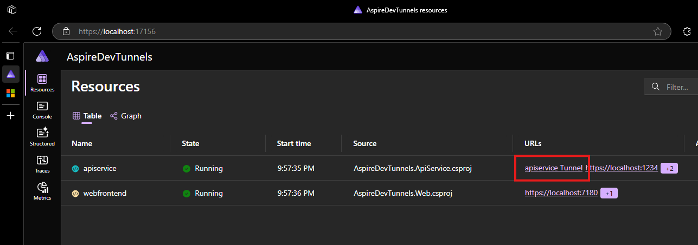

# AspireDevTunnels

Prototype for .NET Aspire DevTunnel Feature

## Dependencies

- [.NET Aspire](https://github.com/dotnet/aspire) (9.2.0)
- [DevTunnels CLI](https://learn.microsoft.com/en-us/azure/developer/dev-tunnels/cli-commands) ([install](https://learn.microsoft.com/en-us/azure/developer/dev-tunnels/get-started?tabs=windows))

## Exposure

Dashboard



OpenApi Spec Behind Tunnel


## Key Files

- [DevTunnelProjectExtensions.cs](./src/AspireDevTunnels.AppHost/Extensions/DevTunnelProjectExtensions.cs)
- [Program.cs](./src/AspireDevTunnels.AppHost/Program.cs)

## Resources

- [Microsoft/Dev-Tunnels GitHub](https://github.com/microsoft/dev-tunnels)
- [Microsoft Build - Advanced Dev Tunnel Features](https://www.youtube.com/watch?v=yCYLurylgj8)

## DevTunnel Dependency

### User Login

`devtunnel user login`

## Issues

1. Dynamic port selection when not specified
1. Persistent vs. Temporary Tunnel creation
1. Private Tunnel support
1. DevTunnel login support (currently depends on `devtunnel user login` before startup)

## Sample CLI Responses

`devtunnel create sample-devtunnel-api --json`:

```json
{
  "tunnel": {
    "tunnelId": "sample-devtunnel-api.usw2",
    "hostConnections": 0,
    "clientConnections": 0,
    "labels": [],
    "tunnelExpiration": "30 days",
    "description": "",
    "currentUploadRate": "0 MB/s (limit: 20 MB/s)",
    "currentDownloadRate": "0 MB/s (limit: 20 MB/s)",
    "accessControl": []
  }
}
```

`devtunnel port add -p 1234 --protocol https --json`:

```json
{
  "port": {
    "tunnelId": "sample-devtunnel-api.usw2",
    "portNumber": 1234,
    "protocol": "https",
    "accessControl": [],
    "clientConnections": 0
  }
}
```

`devtunnel token sample-devtunnel-api --scopes connect --json`

```json
{
  "tunneldId": "sample-devtunnel-api.usw2",
  "ports": [],
  "scope": "connect",
  "lifeTime": "1.00:00:00",
  "expiration": "2025-04-17 20:35:16 UTC",
  "token": "eyJhbGciOiJFUzI1N..."
}
```
