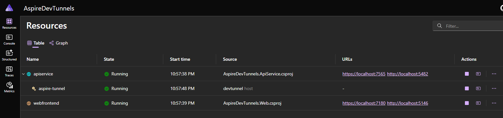
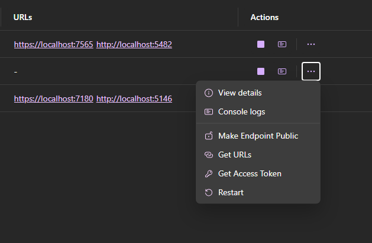

# AspireDevTunnels

Prototype for .NET Aspire DevTunnel Feature

## Dependencies

- [.NET Aspire](https://github.com/dotnet/aspire) (9.2.0)
- [DevTunnels CLI](https://learn.microsoft.com/en-us/azure/developer/dev-tunnels/cli-commands) ([install](https://learn.microsoft.com/en-us/azure/developer/dev-tunnels/get-started?tabs=windows))

## References

- [microsoft/dev-tunnels - GitHub](https://github.com/microsoft/dev-tunnels)

## Resources

- [Microsoft/Dev-Tunnels GitHub](https://github.com/microsoft/dev-tunnels)
- [Microsoft Build - Advanced Dev Tunnel Features](https://www.youtube.com/watch?v=yCYLurylgj8)

## DevTunnel Dependency

### User Login

`devtunnel user login`

## Screenshots

Dashboard



Console Logs


OpenApi Spec Behind Tunnel


Dashboard Actions

- Make Tunnel Endpoints Public
- Get Active Port URLs
- Get Auth Token



## Sample CLI Responses

Create Tunnel

`devtunnel create sample-devtunnel-api --json`:

```json
{
  "tunnel": {
    "tunnelId": "sample-devtunnel-api.usw2",
    "hostConnections": 0,
    "clientConnections": 0,
    "labels": [],
    "tunnelExpiration": "30 days",
    "description": "",
    "currentUploadRate": "0 MB/s (limit: 20 MB/s)",
    "currentDownloadRate": "0 MB/s (limit: 20 MB/s)",
    "accessControl": []
  }
}
```

Add Port

`devtunnel port add -p 1234 --protocol https --json`:

```json
{
  "port": {
    "tunnelId": "sample-devtunnel-api.usw2",
    "portNumber": 1234,
    "protocol": "https",
    "accessControl": [],
    "clientConnections": 0
  }
}
```

Get Auth Token

`devtunnel token sample-devtunnel-api --scopes connect --json`

```json
{
  "tunneldId": "sample-devtunnel-api.usw2",
  "ports": [],
  "scope": "connect",
  "lifeTime": "1.00:00:00",
  "expiration": "2025-04-17 20:35:16 UTC",
  "token": "eyJhbGciOiJFUzI1N..."
}
```

Verify User Logged In

`devtunnel user show --json`

```json
{
  "status": "Logged in",
  "provider": "microsoft",
  "username": "<user emal>",
  "tenantId": "<tenant id>",
  "objectId": "<user object id>"
}
```

Verify installed

`devtunnel --version`

```json
Tunnel CLI version: 1.0.1435+d49a94cc24

Tunnel service URI        : https://global.rel.tunnels.api.visualstudio.com/
Tunnel service version    : 1.0.1427.13095 (2733b94cde; 2025-04-02 01:00:45Z)
Tunnel service cluster    : usw2
```
